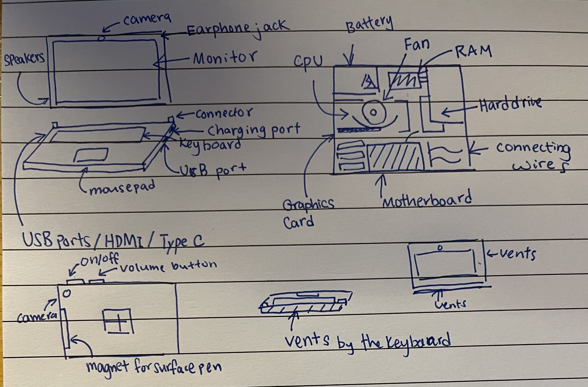

# lesson number 2 working with github markdown files
 markdown is a text file with special formatting with the extension .md
 
# my first picture of a computer

**Fig 1.** My first drawing of a computer
